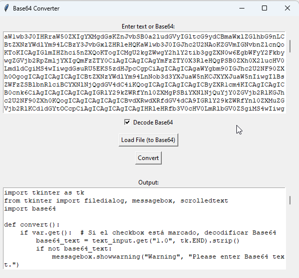

Pequeña tool para abordar archivos de base64 si, se tilda permite decodificar.
al ser interfaz gráfica, requiere python3 b64.py

personalmente recomiendo más el uso de cyberchef, pero nunca está de más intentar armar algo.