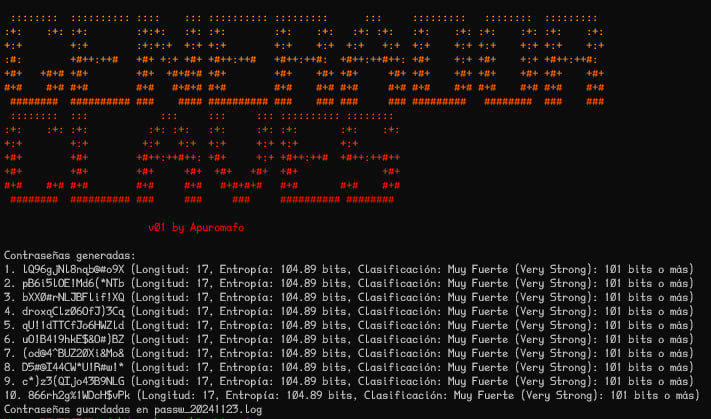

# Generador de Contraseñas 
Este proyecto es un generador de contraseñas aleatorias [passwd.py]   permite a los usuarios crear contraseñas seguras y personalizadas. 
Ofrece opciones para definir la longitud y complejidad de las contraseñas, y clasifica la entropía para asegurar que las contraseñas generadas sean fuertes.
## Características 

- Generación de contraseñas aleatorias con opciones de complejidad. 
- Clasificación de la entropía de las contraseñas generadas. 
- Análisis de contraseñas ingresadas para evaluar su seguridad. 
- Opción de guardar las contraseñas generadas en un archivo de texto. 
- Modo interactivo para obtener preferencias del usuario.

## Uso

Puedes utilizar el generador de contraseñas desde la línea de comandos. Algunos ejemplos de uso son:

- Generar contraseñas con longitud y complejidad predeterminadas:
    
    ```
    python passwd.py
    ```
    
- Especificar la longitud y el número de contraseñas a generar:
    
    ```
    python passwd.py -l 16 -n 5
    ```
    
- Activar el modo interactivo:
    ```
    python passwd.py -i
    ```
    
- Analizar una contraseña existente:
 
    ```
    python passwd.py -p tu_contraseña
    ```

- Generar con una entropía deseada 
 
    ```
    python passwd.py -e 104
    ```


