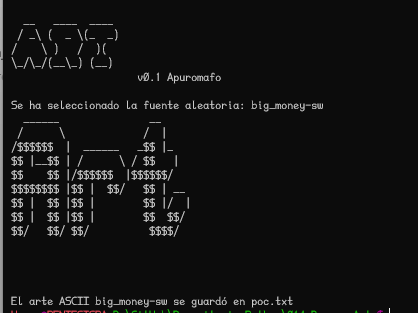
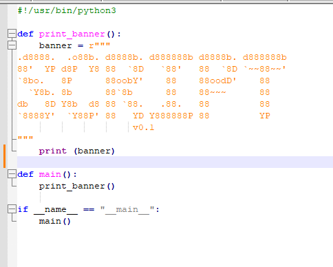

### **Generador de Arte ASCII en Python**

**Descripción:**

Este script de Python te permite transformar cualquier texto en fascinantes obras de arte ASCII, es para uso en banner, algo sencillo para ayudar a Personalizar  tus creaciones eligiendo diferentes fuentes de Pyfiglet.

**Instalación:**

1. **Requisitos previos:** Asegúrate de tener Python 3.x instalado en tu sistema. Puedes verificarlo ejecutando `python3 --version` o `python --version` en tu terminal.
    
2. **Instalación de la librería:** Abre tu terminal o línea de comandos y navega hasta el directorio donde se encuentra este script. Luego, ejecuta el siguiente comando:
     
    ```
    pip3 install pyfiglet
    ```
o bien
```
	pip3 install -r requeriments.txt
```
 
 
**Uso:**

Para ejecutar el script, utiliza el siguiente comando en tu terminal:

Bash

```
python3 Art.py [OPCIONES] -s "TU_TEXTO"
```

Usa el código [con precaución.](/faq#coding)

Reemplaza `"TU_TEXTO"` con el texto que deseas convertir en arte ASCII.

**Opciones disponibles:**

- `-s`, `--string`: (obligatorio) El texto que deseas convertir.
- `-r`, `--random`: Selecciona una fuente aleatoria (opcional).
- `-f`, `--font`: Especifica el nombre de la fuente deseada (opcional). Para ver una lista de fuentes disponibles, ejecuta `python3 ascii_art_generator.py --list-fonts`.
- `-w`, `--width`: Establece el ancho máximo de la salida (opcional, por defecto 200 caracteres).
- `-o`, `--output`: Guarda el arte ASCII en un archivo (opcional).


##**Captura de pantalla

```
 python3 Art.py -r -s "Art" -o poc.txt
```
-r genera una fuente random
-s genera el string dado
-o salida al archivo de texto





si deseas usar estos banner dejo en /demo/ 2 ejemplos de uso:


  