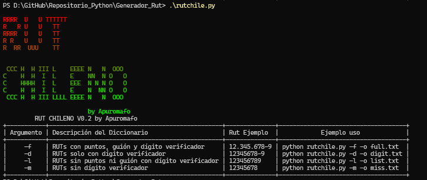

## Descripción:
pequeño script para generación de rut.



 ## Instalación

```
pip install -r requirements.txt
```

## Requerimientos

Para ejecutar este programa, necesitas tener las siguientes bibliotecas instaladas:

* colorama: Agrega colores a la salida de la consola. (Está instalada por defecto en Python 3.10 y versiones posteriores.)
* argparse: Permite leer los argumentos de la línea de comandos( Está instalada por defecto en Python 3.6 y versiones posteriores.).
* prettytable: Formatea datos en tablas(Está instalada por defecto en Python 3.6 y versiones posteriores.).
* random: valores aleatorios